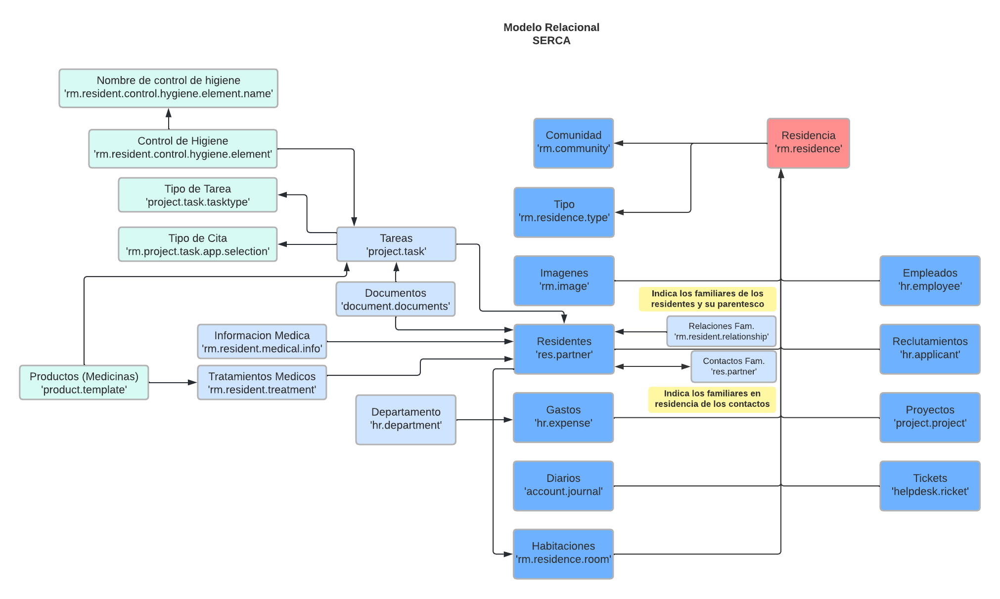

# Relational model (Pacient Control)

* Un residente tiene muchas tareas
* Una tarea tiene muchos documentos (Cuando se trata de una analitica)
* Una tarea tiene muchos elementos de Higiene (Tipo de elemento, hora, observacion, hecho...)
* Un elemento de higiene tiene un tipo de elemento (Ducha, Uñas, Dientes, ...)
* Una tarea tiene un tipo de tarea (Control Basico, Tratamiento, Cita, ...)
* Una tarea tiene un tipo de cita (Si fuera de tipo cita), (Juzgado, Centro Educativo...), ademas, contiene un contacto acompañante para esa cita
* Una tarea tiene muchos productos (En este caso medicinas)

* Un residente tiene mucha informacion medica (Enfermedad y Observacion)
* Un residente muchos tratamientos medico (Nombre del tratamiento, medicina, fecha de inicio, fecha final, activo, ...)
* Un tratamiento medico tiene muchas medicinas

