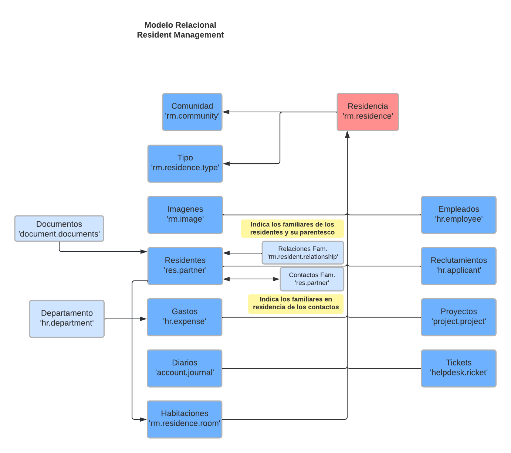

# Relational model (Pacient Management)

* Un residente (Contacto) tiene muchos documentos
* Muchos residentes tienen muchos contactos
* Un residente tiene muchas relaciones familiares

* Este addon añade estas relaciones ademas de modificar las vistas de los empleados con muchos mas campos especificos de un residente de una residencia.

